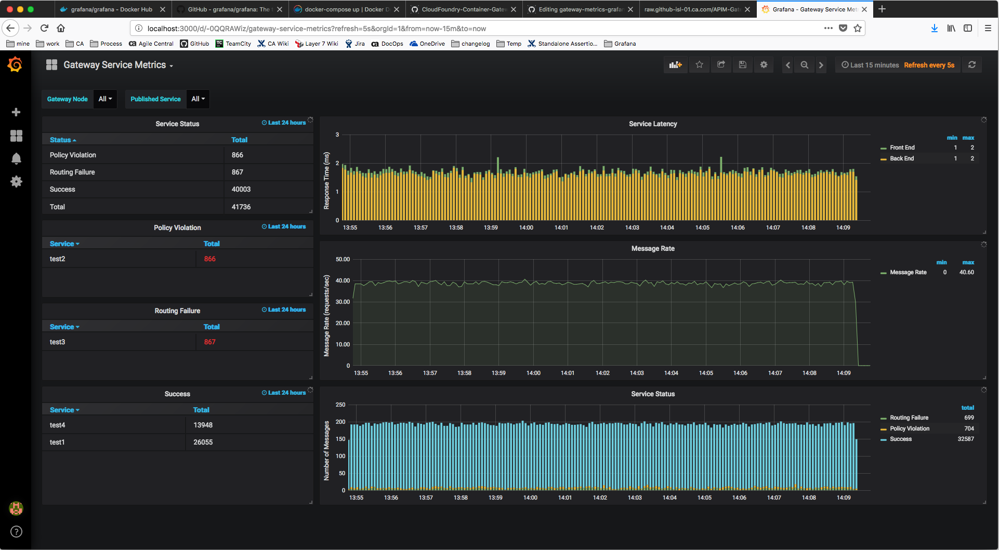

# About
This repository contains example configuration to send service metrics data from Container Gateway to [InfluxDB](https://www.influxdata.com) and visualize metrics dashboard in [Grafana](https://grafana.com).

# Getting Started
Before getting started, you must copy CA API Gateway license file to `./docker/license.xml`.

This example has been tested using the following versions of Docker and Gradle:
* Docker Engine v18.09.0
* Docker Compose v1.23.2
* Gradle v4.10.2

## Starting Docker containers
To start the Docker containers, run the following command:

`docker-compose -f ./docker-compose.yml up`

This will start 4 Docker containers

| Container Name | Description |
| --------|---------|
| gateway-metrics-grafana-example | Container Gateway. Ports 8000, 8080, and 8443 are bind to the host. |
| influxdb | InfluxDB. Port 3000 is bind to the host. |
| grafana | Grafana |
| http-echo | HTTP server used as a downstream service by the Gateway. |

## Login to Grafana
Open a web browser and go to http://localhost:3000. Login using the administrator credentials configured in [docker-compose.yml](docker-compose.yml). Look for `GF_SECURITY_ADMIN_USER` and `GF_SECURITY_ADMIN_PASSWORD` environment variables. Once logged in, you will be directed to the Grafana - Home page.

## Sending traffic to the Gateway
To send traffic to the Gateway, run the following script:

`./send_api_requests.sh`

This script will send request to the following services on the Gateway.

| Service name | Description |
| --------|--------- |
| test1 [/test1] | This service runs successfully. This service sends request to downstream http-echo service. |
| test2 [/test2] | This service fails with policy violation. |
| test3 [/test3] | This service fails with routing failure. |
| test4 [/test4] | This service runs successfully. This service does not send request to downstream service. |

## Viewing Gateway service metrics dashboard
Go back to the Grafana - Home page in the web browser. Click on the dashboard dropdown button next to the 'Home' label near the top of the page. Click on the *Gateway Service Metrics* link to view the service metrics dashboard.

You should see data in the dashboard.

**Tip**: If you don't see any data, go back to the Grafana - Home page and click on the *Gateway Service Metrics* link again.

To stop sending traffic to the Gateway, press `Ctrl + C`

## Stopping Docker containers
To stop running Docker containers, run the following command:

`docker-compose -f ./docker-compose.yml down`

# Managing the Gateway Configuration
The gateway configuration is managed and built using the [gateway-developer-plugin](https://github.com/ca-api-gateway/gateway-developer-plugin).

## Building a Deployment Package
Build a deployment package by running `gradle build`. This will create a gw7 package in `deployment/build/gateway/deployment-1.0.0.gw7`

## Exporting Policy Updates
In order to export policy updates first make sure your gateway is running. Then run `gradle export`. This will export relevant policy changes.

# Giving Back
## How You Can Contribute
Contributions are welcome and much appreciated. To learn more, see the [Contribution Guidelines][contributing].

## License

Copyright (c) 2018 CA. All rights reserved.

This software may be modified and distributed under the terms
of the MIT license. See the [LICENSE][license-link] file for details.

 [license-link]: /LICENSE
 [contributing]: /CONTRIBUTING.md
