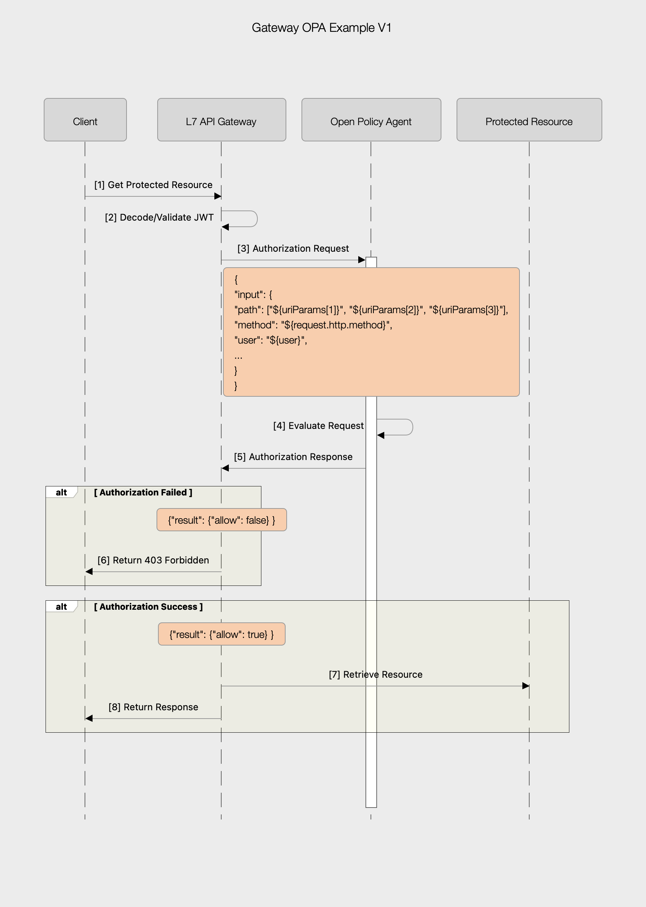
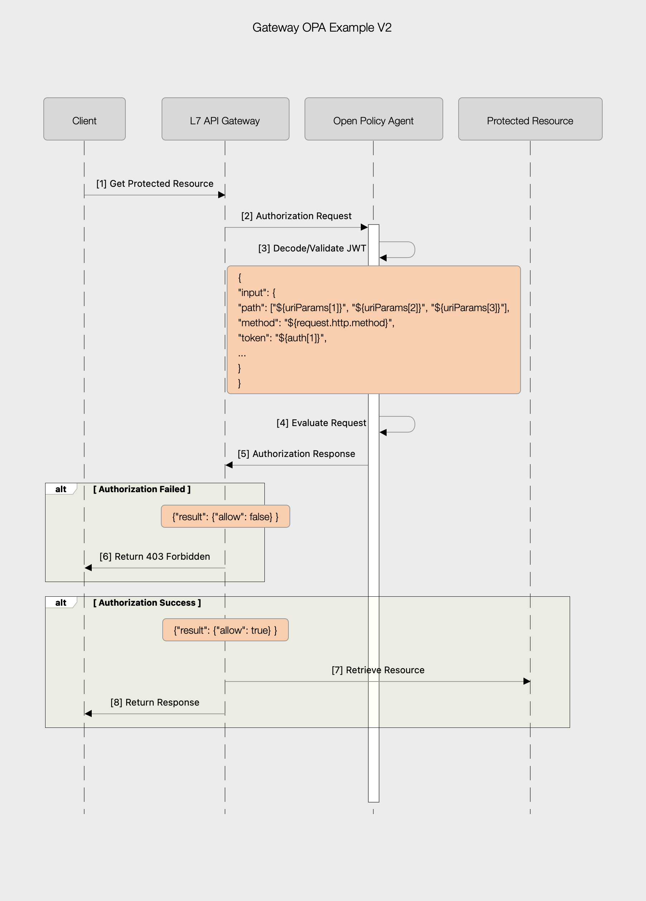

## Layer7 Gateway OPA Example
This example contains a very simple implementation of the Layer7 API Gateway calling out
to OPA ([Open Policy Agent](https://www.openpolicyagent.org/docs/latest/)) for AuthN/Z decisions.

If you are interested in, or have implemented
more advanced examples please feel free to add them to this repository.

### Prerequisites
- Access to a Kubernetes Cluster (developed against 1.23)
- kubectl (Kubernetes CLI)
- Helm v3.x
- Clone this repository
  - git clone https://github.com/Layer7-Community/Integrations.git
- Place a Gateway v10 license file in ${REPO_PATH}/gateway-opa-example/gateway. The file should be called 'license' with ***no extension***

#### Note
The API Gateway is configured to run in ephemeral mode in this example, secrets and configmaps are created using Kustomize and subsequently referenced in ${REPO_PATH}/gateway-opa-example/gateway/helm/gateway-values.yaml

### Install
The install process creates two namespaces ('opa' and 'layer7') and deploys the necessary resources for the example.

***NOTE:*** The install process automatically sets license.accept to true

- cd ${REPO_PATH}/gateway-opa-example
- ```$ make install```

### Uninstall
The uninstall process simply deletes the two namespaces created on install

```$ make uninstall```

### Testing
A Postman collection, complete with sample JWTs is included in this repository. You'll also need the IP Address of the Gateway that was deployed during the install process
- kubectl get svc -n layer7
```NAME          TYPE           CLUSTER-IP       EXTERNAL-IP     PORT(S)                         AGE
ssg-gateway   LoadBalancer   10.106.109.161   ***192.168.1.223***   8443:30448/TCP,9443:31656/TCP   120m
```

- Import the collection from ${REPO_PATH}/gateway-opa-example/postman  into Postman
- Update the 'gatewayUrl' variable with the EXTERNAL-IP you see when you run the command above in your own environment.

Note: if you do not have an IP Provisioning service the EXTERNAL-IP will be stuck in a ```<pending>``` state. If this is the case you can either install one like [metallb](https://metallb.org) or use the NodePort listed in PORT(S).

Example from the above environment:
- 30448 ==> 8443 
- 31656 ==> 9443
 
The standard tests include a user 'arnold' that has read access to accounts for one environment (test). All requests should initially be successful, if you change the action header to 'write' you should receive a forbidden message. There are 3 users configured in total, 'nina' has access to all environments.

You can also log in to the Gateway via Policy Manager to see how the Policies are configured.
- username: admin
- password: 7layer

#### V1 and V2 examples
- In V1 the Gateway validates the JWT upfront



- In V2 the JWT is validated by OPA


